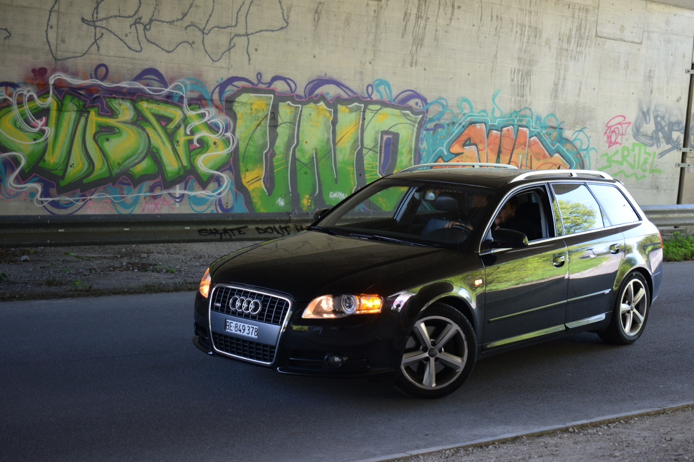
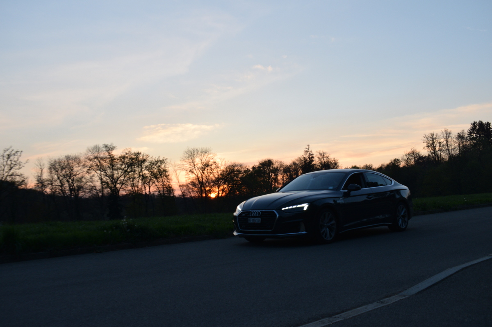
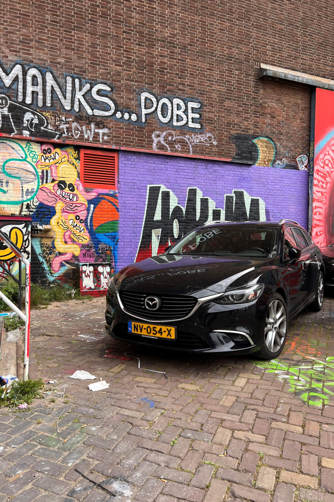

+++
title = "Autofotografie"
date = "2022-05-17"
draft = false
pinned = false
+++

Mein Projekt starte ich mit Unterstützung eines Freundes. Ich wollte zuerst einige Aufnahmen machen in meinem Wohnort. Mein Kollege ist auch im Besitz eines Führerscheins und eines Autos, deswegen habe ich ihn um Hilfe gebeten. Er fuhr dann mit seinem Wagen an mir vorbei und ich habe die Fotos geschossen. Das aufwendige war, das ständige Wenden seines Fahrzeug um wieder erneut an mir vorbei zu fahren. Zudem war es an dem Tag sehr heiss. Nach einer Viertelstunde Fotos beim Vorbeifahren zu machen, wechselten wir unseren Standort und nahmen  Standaufnahmen auf in meiner Siedlung mit den Hochhäusern im Hintergrund. Dann nahmen wir auch noch paar Bilder in einer nicht viel befahrener Unterführung auf um einen abwechslungsreichen Hintergrund mit Graffiti zu schaffen. 

Eine Woche später ging ich nochmals Fotografien mit einem anderem Fahrzeug bei Sonnenuntergang. Ich kam ziemlich in stress weil die Sonne schon fast untergegangen war.

Als ich auf der Studienreise in Amsterdam war auf einer Graffiti-Führung gewesen war, habe ich ein Auto bemerkt, welches ideal vor einem Graffiti parkiert worden ist.

